# Lab 3 - Python
I pledge my honor that I have abided by the Stevens Honor System.

# Assignment

### python packages
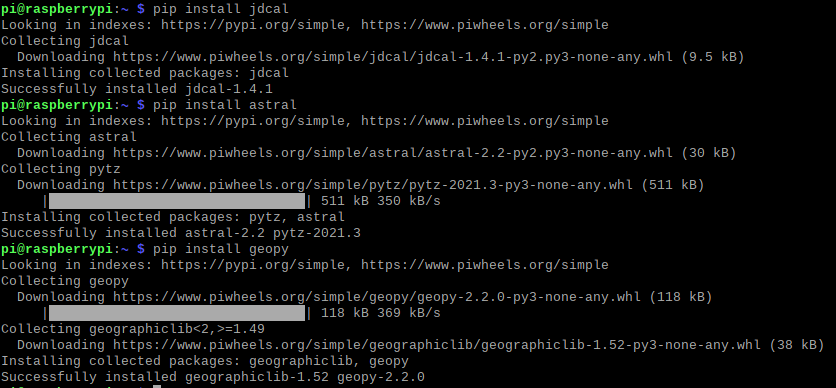

### cd
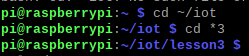

### julian
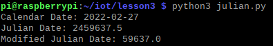

### date_example
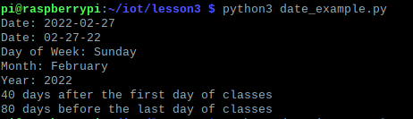

### datetime_example
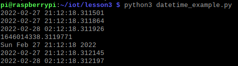

### time_example
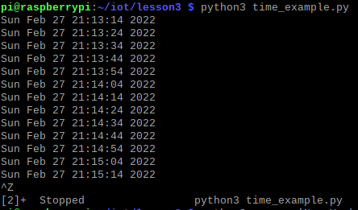

### sun
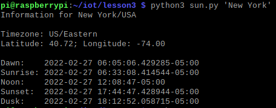

### moon
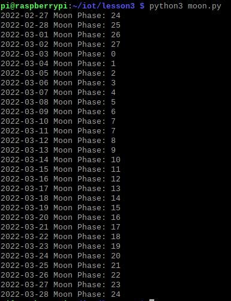

### coordinates
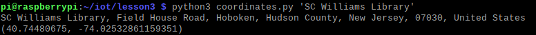

### address
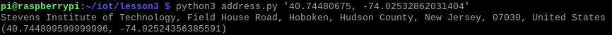

### cpu
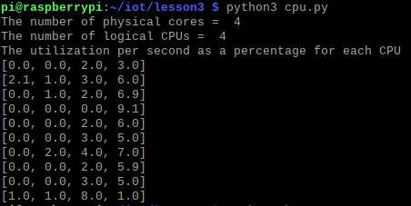

### battery
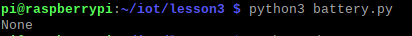

### documentstats
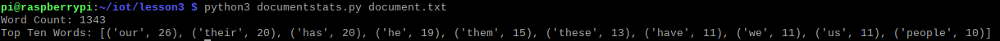
