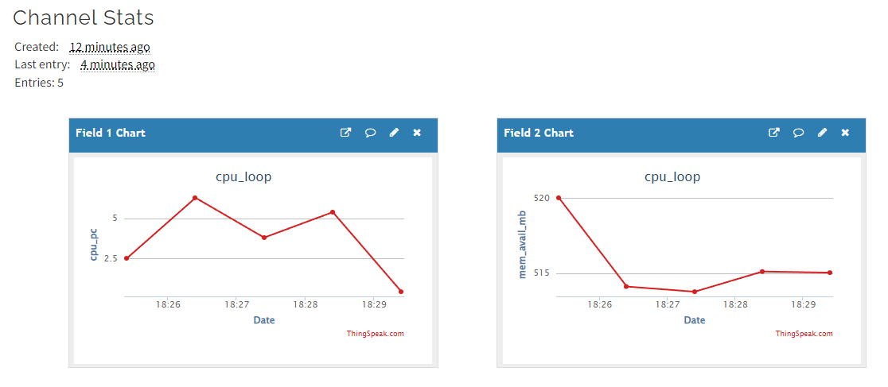

# Lab 7 — ThingSpeak and Google Sheets
I pledge my honor that I have abided by the Stevens Honor System.

### Review and run thingspeak_feed.py
```
pi@raspberrypi:~ $ sudo pip3 install -U psutil
Looking in indexes: https://pypi.org/simple, https://www.piwheels.org/simple
Requirement already satisfied: psutil in /usr/lib/python3/dist-packages (5.8.0)
Collecting psutil
  Downloading https://www.piwheels.org/simple/psutil/psutil-5.9.0-cp39-cp39-linux_armv7l.whl (278 kB)
     |████████████████████████████████| 278 kB 381 kB/s 
Installing collected packages: psutil
  Attempting uninstall: psutil
    Found existing installation: psutil 5.8.0
    Not uninstalling psutil at /usr/lib/python3/dist-packages, outside environment /usr
    Can't uninstall 'psutil'. No files were found to uninstall.
Successfully installed psutil-5.9.0
pi@raspberrypi:~ $ cd ~/demo
pi@raspberrypi:~/demo $ cp ~/iot/lesson7/thingspeak_cpu_loop.py .
pi@raspberrypi:~/demo $ cp ~/iot/lesson7/thingspeak_feed.py .
pi@raspberrypi:~/demo $ cat thingspeak_cpu_loop.py
import http.client, urllib.request, urllib.parse, urllib.error
from time import localtime, strftime
import psutil
import time
def doit():
	cpu_pc = psutil.cpu_percent()
	mem = psutil.virtual_memory()
	mem_avail_mb = mem.available/(1024*1024)
	params = urllib.parse.urlencode({'field1': cpu_pc, 'field2':
             mem_avail_mb,'key':'YOURKEYHERE'})
	headers = {"Content-type":
               "application/x-www-form-urlencoded","Accept": "text/plain"}
	conn = http.client.HTTPConnection("api.thingspeak.com:80")
	try:
		conn.request("POST", "/update", params, headers)
		response = conn.getresponse()
		print(cpu_pc)
		print(mem_avail_mb)
		print(strftime("%a, %d %b %Y %H:%M:%S", localtime()))
		print(response.status, response.reason)
		data = response.read()
		conn.close()
	except:
		print("connection failed")
#sleep for 60 seconds (message update interval limit of 15 seconds)
if __name__ == "__main__":
	while True:
		doit()
		time.sleep(60)
pi@raspberrypi:~/demo $ cat thingspeak_feed.py
import http.client, urllib.request, urllib.parse, urllib.error
from time import localtime, strftime
import psutil
import time
"""
2020-11-26: Pridhvi Myneni added lines 13-18, 25, and 43-54
1. gitignore (https://git-scm.com/docs/gitignore) now prevents students from pushing up credentials.
2. This program now attempts to cache the API key, but always prompts the user for their preference prior to saving credentials locally.
3. Pickle data type used to store credentials. Pickle is a binary storage version of JSON. Please note not-human-readable does not mean secure.
4. Removed key storage in source, which is generally a bad practice, as it leads to version control systems having your key.
5. Key for storage in a dictionary. This could be expanded in the future if other information needs to be similarly stored.
"""
from pickle import dump as pickle_dump
from pickle import load as pickle_load
from os.path import exists as file_exists
from os.path import isfile as is_file
PICKLE_FILE_NAME = "API_KEY.pickle"
API_KEY_INDEX = "API_KEY"
def doit():
	cpu_pc = psutil.cpu_percent()
	mem = psutil.virtual_memory()
	mem_avail_mb = mem.available/(1024*1024)
	params = urllib.parse.urlencode({'field1': cpu_pc, 'field2':
#             mem_avail_mb,'key':'YOURKEYHERE'})
             mem_avail_mb,'key':KEY})
	headers = {"Content-type":
               "application/x-www-form-urlencoded","Accept": "text/plain"}
	conn = http.client.HTTPConnection("api.thingspeak.com:80")
	try:
		conn.request("POST", "/update", params, headers)
		response = conn.getresponse()
		print(cpu_pc)
		print(mem_avail_mb)
		print(strftime("%a, %d %b %Y %H:%M:%S", localtime()))
		print(response.status, response.reason)
		data = response.read()
		conn.close()
	except:
		print("connection failed")
#sleep for 60 seconds (message update interval limit of 15 seconds)
if __name__ == "__main__":
#caching the Write Key for the ThingSpeak API
	if file_exists(PICKLE_FILE_NAME) and is_file(PICKLE_FILE_NAME):
		save_file = None
		with open(PICKLE_FILE_NAME, 'rb') as f:
			save_file = pickle_load(f)
		KEY = save_file[API_KEY_INDEX]
	else:
		key = input("An API key savefile was not found. Enter Write API Key >>> ")
		should_save = input("Should we save this key for future use? [y/N] >>> ")
		KEY = key.strip()
		if len(should_save)>0 and should_save.lower().startswith("y"):
			with open(PICKLE_FILE_NAME, 'wb') as f:
				pickle_dump({API_KEY_INDEX: KEY}, f)  
	while True:
		doit()
		time.sleep(60)
pi@raspberrypi:~/demo $ python3 thingspeak_feed.py
An API key savefile was not found. Enter Write API Key >>> [redacted]
Should we save this key for future use? [y/N] >>> y
2.5
520.015625
Sun, 27 Mar 2022 18:25:24
200 OK
python3 thingspeak_feed.py6.3
514.125
Sun, 27 Mar 2022 18:26:24
200 OK
3.8
513.78125
Sun, 27 Mar 2022 18:27:24
200 OK
5.4
515.12109375
Sun, 27 Mar 2022 18:28:24
200 OK
0.4
515.046875
Sun, 27 Mar 2022 18:29:24
200 OK
^CTraceback (most recent call last):
  File "/home/pi/demo/thingspeak_feed.py", line 57, in <module>
    time.sleep(60)
KeyboardInterrupt
```

### Results


### Copy Files
```
pi@raspberrypi:~/demo $ cp ~/iot/lesson3/system_info.py .
pi@raspberrypi:~/demo $ cp ~/iot/lesson7/rpi_spreadsheet.py .
pi@raspberrypi:~/demo $ mv ~/Downloads/rpidata-*.json ~/demo
mv: cannot stat '/home/pi/Downloads/rpidata-*.json': No such file or directory
```
